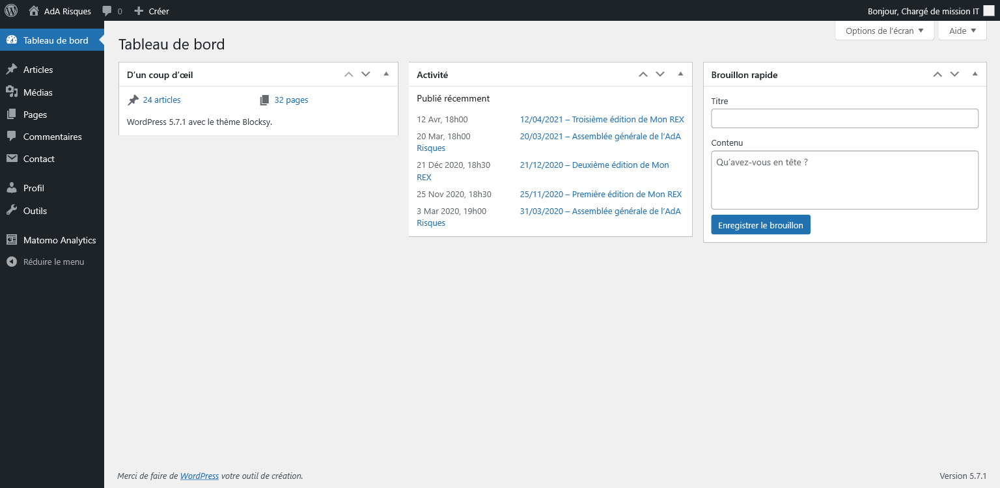

L'interface d'administration est accessible à https://ada-risques.fr/wp-admin/.

Chaque membre du bureau dispose d'un compte fonctionnel, non nominatif.\
En cas d'oubli du mot de passe spécifique, il est possible de le réinitialiser par mail à partir du lien « Mot de passe oublié ? » sur l'interface de connexion.

Une fois authentifié, vous accédez au tableau de bord, à gauche duquel figure le menu.

Vous pouvez changer votre mot de passe à partir de la page « <i class="fas fa-user"></i> Profil »

