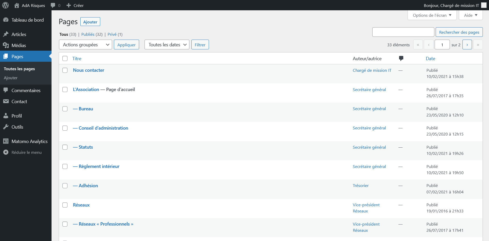
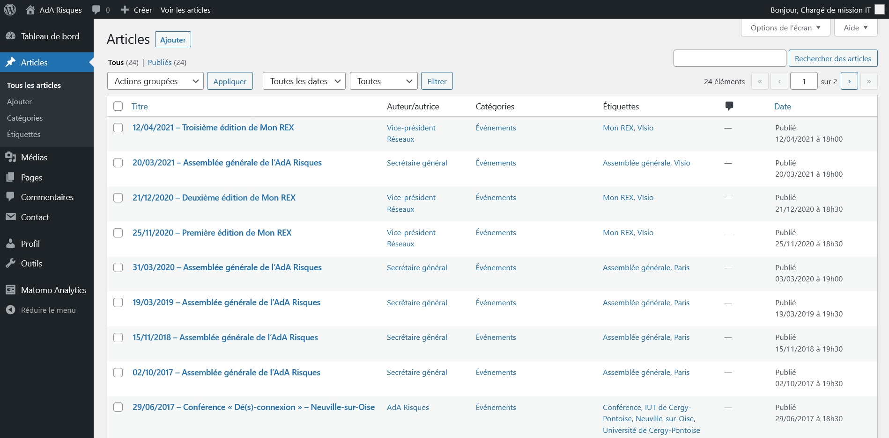
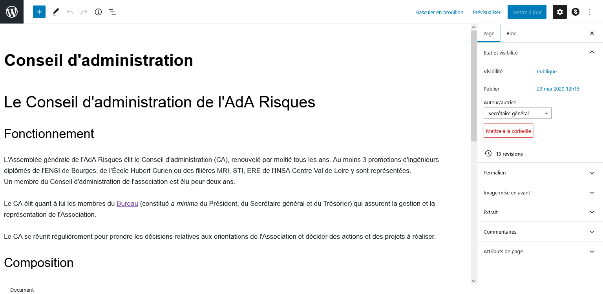

Le contenu est organisé en articles et en pages.

Les caractéristiques communes sont :

- un titre ;
- une date de publication, à partir de laquelle seulement l'article ou la page sera publié ;
- un auteur, globalement sans importance ;
- un permalien, par défaut basé sur la propriété « titre » mais personnalisable, et qui sera utilisable pour référencer le contenu depuis l'extérieur du site (dans un email par exemple) ;
- une image mise en avant (optionnelle) ;
- un extrait (optionnel).

Les deux types de publications peuvent être ouverts aux commentaires, cette fonctionnalité est cependant désactivée par défaut sur l'ensemble du site car ce n'est pas l'objectif d'un site vitrine.

## Pages

Les pages sont du contenu pérenne à valeur générale et l'essentiel du site est contitué ainsi.

Elle peuvent être imbriquées de manière à former une arborescence (comme ci-dessous « L'Association » qui regroupe 5 autres pages).


Dans le thème utilisé, la propriété « titre » des pages n'est affichée que dans le fil d'Arianne en tête des pages (par exemple « <i class="fa fa-home"></i> > L'Association > Conseil d'administration »).

Un titre (de niveau H1) est présent dans le corps du texte et permet d'afficher un titre plus long que dans le fil d'Arianne (par exemple « Le Conseil d'administration de l'AdA Risques »)


## Articles

Les articles sont des entrées horodatées qui viennent animer le site, avec deux propriétés supplémentaires :

- une catégorie, celle principalement utilisée étant celle des [événements](https://preprod.ada-risques.fr/rubriques/evenements/) ;
- des étiquettes (*tags*), par exemple pour préciser le type d'événement dont il s'agit et sa localisation (ville ou pays).


La convention éditoriale utilisée sur les articles importés de l'ancien site vitrine est de préfixer le titre de l'événement par sa date afin de lui donner immédiatement de la visibilité (par exemple « 20/03/2021 – Assemblée générale de l’AdA Risques »)


## Éditeur de contenu

L'éditeur de contenu, identique pour les articles et les pages, s'apparente à un traitement de texte léger, mais assez complet.

La toute première ligne, en gras, est le titre de l'article ou de la page, ci-dessous « Conseil d'administration », suivie par le contenu proprement dit. Dans la colonne à droite, vous pourrez modifier les autres propriétés de l'article ou de la page.

Le « <i class="fas fa-plus-square"></i> » en haut à gauche permet d'ajouter des blocs, les plus utilisés seront :

- Texte :
  - <i class="fas fa-paragraph"></i> Paragraphe
  - <i class="fas fa-bookmark"></i> Titre
  - <i class="fas fa-list"></i> Liste

  ainsi éventuellement que :

  - <i class="fas fa-quote-right"></i> Citation
  - <i class="fas fa-table"></i> Tableau
- Média
  - <i class="fas fa-image"></i> Image (comme sur l'article sur la [Première journée Cybersécurité](https://preprod.ada-risques.fr/journee-cybersecurite-2017/))
  - <i class="fas fa-images"></i> Galerie (pour un présenter un ensemble d'image, par exemple sur la page [Les rendez-vous des ingénieurs](https://preprod.ada-risques.fr/activites/journee-des-anciens/))
  - <i class="fas fa-folder"></i> Fichier (comme les rapports et PV d'assemblée générale, par exemple [celle de 2021](https://preprod.ada-risques.fr/assemblee-generale-2021/))

Une fois le contenu édité, pensez à l'enregistrer en haut à droite (bouton bleu « Publier » ou « Mettre à jour »).

Pour revenir au tableau de bord ou la la liste des articles ou des pages, cliquez sur le logo WordPress « <i class="fab fa-wordpress"></i> » en haut à gauche.   

