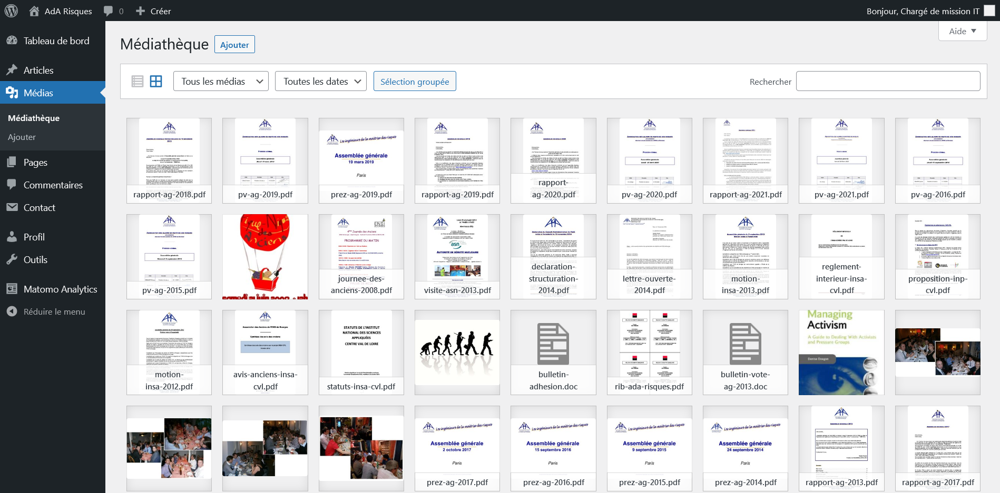
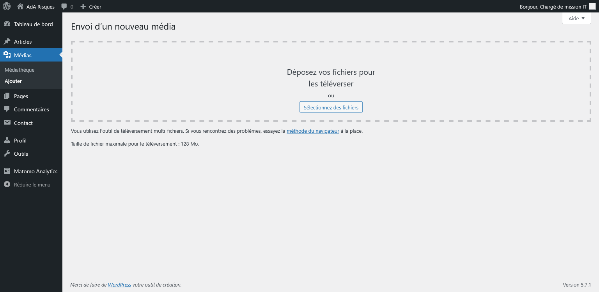

La solution embarque une solution de médiathèque, tant pour les fichiers publiques que les images.

La totalité des documents *essentiels* ont normalement été réimportés depuis l'ancien <a class="app-name">e-net</a>.

Les médias ont les caractéristiques suivantes :

- un titre, qui sera utilisé pour présenter les fichiers
- un permalien, qui doit être unique **à l'échelle du site**
- un auteur de téléversement
- une page ou un article de téléversement (optionnel), permettant d'attacher le média à ce contenu et de fixer le permalien sous ce contenu (la partie propre au média doit néanmoins rester unique à l'échelle du site)

Pour ajouter un média, il suffit d'utiliser la page d'envoi et de glisser-déposer ou sélectionner les fichiers à envoyer, puis valider. Vous pourrez ensuite modifier le titre, le permalien et la page ou l'article de rattachement


Quelque soit le permalien, le média sera disponible au téléchargement avec son nom d'origine !


